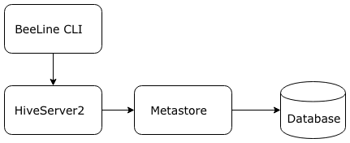
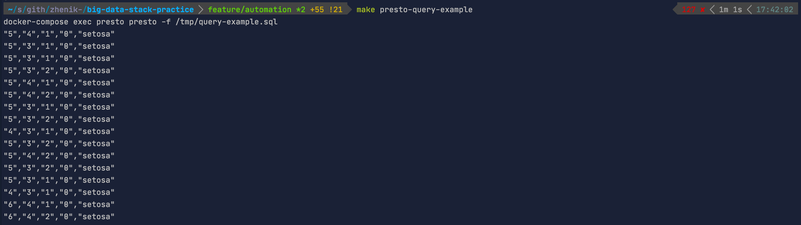
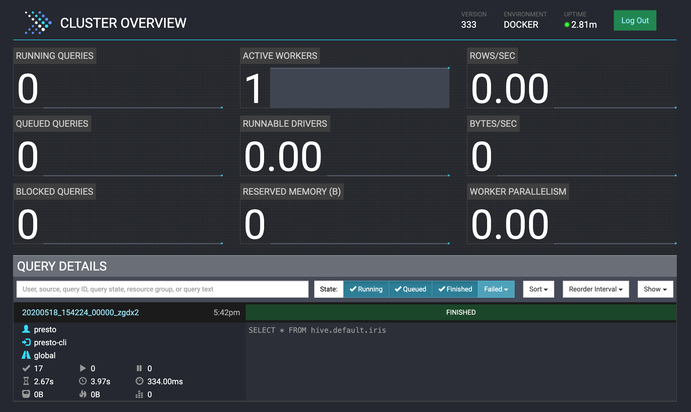

# Proof of concept 
Hive meta-store and S3

## How to run 
```bash
make up
```

to stop
```bash
make down
```

* Minio (minio, minio123) [localhost:9000](http://localhost:9000)
* Presto (admin, no password) [localhost:8080](http://localhost:8080)
## Diagram
To create tables for test data, I use Option 1 in docker-compose.

  
Hive deployment  




screen shots




## Useful commands (debug)
### Minio
```bash
mc config host add super-puper-config http://localhost:9000 minio minio123
mc mb super-puper-config/hive
mc mb super-puper-config/default
mc cp ./dummy-data/iris.csv super-puper-config/hive/warehouse/iris/iris.csv
mc cp ./dummy-data/users.csv super-puper-config/hive/warehouse/users/users.csv
```

### Beeline cli
Different ways how to connect
```bash
# from metastore (loopback) 
beeline -u jdbc:hive2://
    
# from hive-server (to metastore)
beeline -u "jdbc:hive2://localhost:10000/default;auth=noSasl" -n hive -p hive  

# exec script from file (example)
beeline -u jdbc:hive2:// -f /tmp/create-table.hql
```
SQL
```
SHOW DATABASES;
SHOW TABLES IN <database-name>;
DROP DATABASE <database-name>;
```
Dummy data. table creation on S3 for iris data set (check /dummy-data/iris.csv)
```sql
CREATE EXTERNAL TABLE iris (sepal_length DECIMAL, sepal_width DECIMAL, 
petal_length DECIMAL, petal_width DECIMAL, species STRING) 
ROW FORMAT DELIMITED 
FIELDS TERMINATED BY ','
LINES TERMINATED BY '\n'
LOCATION 's3a://hive/warehouse/iris/'
TBLPROPERTIES ("skip.header.line.count"="1");
```

Dummy data. table creation on S3 for iris data set (check /dummy-data/users.csv)
```sql
CREATE EXTERNAL TABLE users (id DECIMAL, name STRING, 
lastname STRING) 
ROW FORMAT DELIMITED 
FIELDS TERMINATED BY ','
LINES TERMINATED BY '\n'
LOCATION 's3a://hive/warehouse/users/';
```

### Presto 
```bash
SHOW CATALOGS [ LIKE pattern ]
SHOW SCHEMAS [ FROM catalog ] [ LIKE pattern ]
SHOW TABLES [ FROM schema ] [ LIKE pattern ]
```

Presto does not have proper support for CSV files currently:
* https://stackoverflow.com/a/56662729 
* https://coding-stream-of-consciousness.com/2019/06/05/presto-hive-external-table-textfile-limitations/ 
* https://github.com/prestosql/presto/pull/920#issuecomment-517585649 
